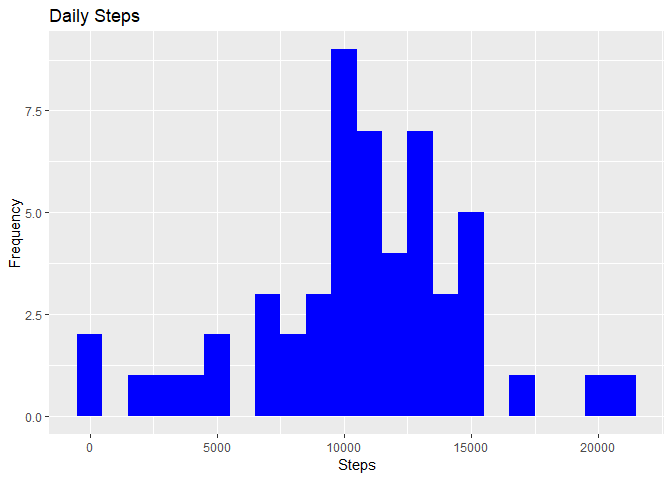
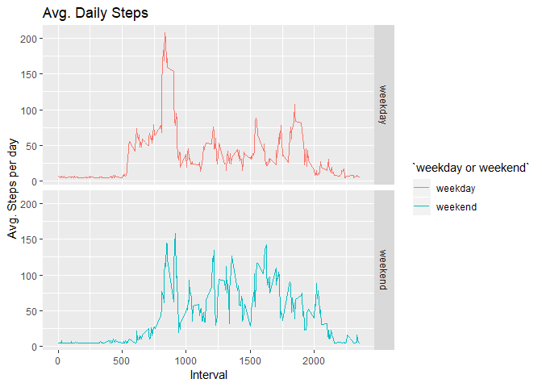

github repo for rest of specialization: [Data Science Coursera](https://github.com/mGalarnyk/datasciencecoursera)

## Introduction
It is now possible to collect a large amount of data about personal movement using activity monitoring devices such as a Fitbit, Nike Fuelband, or Jawbone Up. These type of devices are part of the “quantified self” movement – a group of enthusiasts who take measurements about themselves regularly to improve their health, to find patterns in their behavior, or because they are tech geeks. But these data remain under-utilized both because the raw data are hard to obtain and there is a lack of statistical methods and software for processing and interpreting the data.

This assignment makes use of data from a personal activity monitoring device. This device collects data at 5 minute intervals through out the day. The data consists of two months of data from an anonymous individual collected during the months of October and November, 2012 and include the number of steps taken in 5 minute intervals each day.

The data for this assignment can be downloaded from the course web site:

* Dataset: [Activity monitoring data](https://d396qusza40orc.cloudfront.net/repdata%2Fdata%2Factivity.zip) 

The variables included in this dataset are:

steps: Number of steps taking in a 5-minute interval (missing values are coded as 𝙽𝙰) </br>
date: The date on which the measurement was taken in YYYY-MM-DD format </br>
interval: Identifier for the 5-minute interval in which measurement was taken </br>
The dataset is stored in a comma-separated-value (CSV) file and there are a total of 17,568 observations in this dataset. 

## Loading and preprocessing the data
Unzip data to obtain a csv file.


```r
library(data.table)
```

```
## Warning: package 'data.table' was built under R version 3.5.2
```

```r
library(dplyr)
```

```
## Warning: package 'dplyr' was built under R version 3.5.2
```

```
## 
## Attaching package: 'dplyr'
```

```
## The following objects are masked from 'package:data.table':
## 
##     between, first, last
```

```
## The following objects are masked from 'package:stats':
## 
##     filter, lag
```

```
## The following objects are masked from 'package:base':
## 
##     intersect, setdiff, setequal, union
```

```r
library(ggplot2)
path <- getwd()
url <-  "https://d396qusza40orc.cloudfront.net/repdata%2Fdata%2Factivity.zip"
download.file(url, file.path(path, "dataFiles.zip"))
unzip(zipfile = "dataFiles.zip")
```

## Reading csv Data into Data.Table. 

```r
activity.df <- fread(file.path(path, "activity.csv"))
```

## What is mean total number of steps taken per day?

1. Calculate the total number of steps taken per day


```r
total_steps.df <- activity.df %>% group_by(date) %>% summarize(total_steps = sum(steps))
head(total_steps.df, 10)
```

```
## # A tibble: 10 x 2
##    date       total_steps
##    <chr>            <int>
##  1 2012-10-01          NA
##  2 2012-10-02         126
##  3 2012-10-03       11352
##  4 2012-10-04       12116
##  5 2012-10-05       13294
##  6 2012-10-06       15420
##  7 2012-10-07       11015
##  8 2012-10-08          NA
##  9 2012-10-09       12811
## 10 2012-10-10        9900
```

2. If you do not understand the difference between a histogram and a barplot, research the difference between them. Make a histogram of the total number of steps taken each day. 


```r
ggplot(total_steps.df, aes(x = total_steps)) +
  geom_histogram(fill = "blue", binwidth = 1000) + 
  labs(title = "Daily Steps", x = "Steps", y = "Frequency")
```

```
## Warning: Removed 8 rows containing non-finite values (stat_bin).
```

<!-- -->

3. Calculate and report the mean and median of the total number of steps taken per day

```r
summary_steps.df <- total_steps.df %>% summarize(mean_steps = mean(total_steps, na.rm = TRUE), median_steps = median(total_steps, na.rm = TRUE))
```

```
## Warning: package 'bindrcpp' was built under R version 3.5.2
```

```r
print(summary_steps.df)
```

```
## # A tibble: 1 x 2
##   mean_steps median_steps
##        <dbl>        <int>
## 1     10766.        10765
```

## What is the average daily activity pattern?

1. Make a time series plot (i.e. 𝚝𝚢𝚙𝚎 = "𝚕") of the 5-minute interval (x-axis) and the average number of steps taken, averaged across all days (y-axis)


```r
summary_steps_interval.df <- activity.df %>% group_by(interval) %>% summarize(mean_steps = mean(steps, na.rm = TRUE))

ggplot(summary_steps_interval.df, aes(x = interval , y = mean_steps)) + 
  geom_line(color="blue", size=1) + 
  labs(title = "Avg. Daily Steps", x = "Interval", y = "Avg. Steps per day")
```

<!-- -->

2. Which 5-minute interval, on average across all the days in the dataset, contains the maximum number of steps?


```r
max_interval <- summary_steps_interval.df %>% filter(mean_steps == max(summary_steps_interval.df$mean_steps)) %>% select(interval)

print(max_interval)
```

```
## # A tibble: 1 x 1
##   interval
##      <int>
## 1      835
```


## Imputing missing values

1. Calculate and report the total number of missing values in the dataset (i.e. the total number of rows with 𝙽𝙰s)


```r
nrow(activity.df[is.na(steps),])
```

```
## [1] 2304
```

2. Devise a strategy for filling in all of the missing values in the dataset. The strategy does not need to be sophisticated. For example, you could use the mean/median for that day, or the mean for that 5-minute interval, etc.


```r
# Filling in missing values with median of dataset. 
activity.df[is.na(activity.df$steps), "steps"] <- mean(activity.df$steps, na.rm = TRUE)
```

```
## Warning in `[<-.data.table`(`*tmp*`, is.na(activity.df$steps), "steps", :
## Coerced double RHS to integer to match the type of the target column
## (column 1 named 'steps'). One or more RHS values contain fractions which
## have been lost; e.g. item 1 with value 37.382600 has been truncated to 37.
```

3. Create a new dataset that is equal to the original dataset but with the missing data filled in.


```r
#Create tidy data (copy data)
tidy_activity.df <- activity.df
# Fill in NAs with mean
tidy_activity.df[is.na(tidy_activity.df$steps), "steps"] <- mean(activity.df$steps, na.rm = TRUE)
# Create total steps by date
tidy_total_steps.df <- tidy_activity.df %>% group_by(date) %>% summarize(total_steps = sum(steps))
```

4. Make a histogram of the total number of steps taken each day and calculate and report the mean and median total number of steps taken per day. Do these values differ from the estimates from the first part of the assignment? What is the impact of imputing missing data on the estimates of the total daily number of steps?


```r
ggplot(tidy_total_steps.df, aes(x = total_steps)) +
  geom_histogram(fill = "blue", binwidth = 1000) + 
  labs(title = "Daily Steps", x = "Steps", y = "Frequency")
```

<!-- -->

Summary of the Data sets


```r
tidy_summary_steps.df <- tidy_total_steps.df %>% summarize(mean_steps = mean(total_steps, na.rm = TRUE), median_steps = median(total_steps, na.rm = TRUE))
print(tidy_summary_steps.df)
```

```
## # A tibble: 1 x 2
##   mean_steps median_steps
##        <dbl>        <int>
## 1     10752.        10656
```

```r
print(summary_steps.df)
```

```
## # A tibble: 1 x 2
##   mean_steps median_steps
##        <dbl>        <int>
## 1     10766.        10765
```


## Are there differences in activity patterns between weekdays and weekends?

1. Create a new factor variable in the dataset with two levels – “weekday” and “weekend” indicating whether a given date is a weekday or weekend day.


```r
#Created day of the week and then labeled either weekday or weekend
activity.df[, date := as.POSIXct(date, format = "%Y-%m-%d")]
activity.df[, 'day of week' := weekdays(x = date)]
setDT(activity.df)
activity.df[grepl(pattern = "Monday|Tuesday|Wednesday|Thursday|Friday", x = activity.df$`day of week`), "weekday or weekend"] <- "weekday"
activity.df[grepl(pattern = "Saturday|Sunday", x = activity.df$`day of week`), "weekday or weekend"] <- "weekend"
activity.df[ , `weekday or weekend` := as.factor(`weekday or weekend`)]
head(activity.df, 10)
```

```
##     steps       date interval day of week weekday or weekend
##  1:    37 2012-10-01        0      Monday            weekday
##  2:    37 2012-10-01        5      Monday            weekday
##  3:    37 2012-10-01       10      Monday            weekday
##  4:    37 2012-10-01       15      Monday            weekday
##  5:    37 2012-10-01       20      Monday            weekday
##  6:    37 2012-10-01       25      Monday            weekday
##  7:    37 2012-10-01       30      Monday            weekday
##  8:    37 2012-10-01       35      Monday            weekday
##  9:    37 2012-10-01       40      Monday            weekday
## 10:    37 2012-10-01       45      Monday            weekday
```

2. Make a panel plot containing a time series plot (i.e. 𝚝𝚢𝚙𝚎 = "𝚕") of the 5-minute interval (x-axis) and the average number of steps taken, averaged across all weekday days or weekend days (y-axis). See the README file in the GitHub repository to see an example of what this plot should look like using simulated data.


```r
#Average Intervals
summary_steps_interval.df2 <- activity.df %>% group_by(`weekday or weekend`, interval) %>% summarize(mean_steps = mean(steps, na.rm = TRUE))

# Make a panel plot containing a timer series
ggplot(summary_steps_interval.df2, aes(x = interval , y = mean_steps, color = `weekday or weekend`)) +
  facet_grid(`weekday or weekend`~.)+
  geom_line() + 
  labs(title = "Avg. Daily Steps", x = "Interval", y = "Avg. Steps per day")
```

<!-- -->
